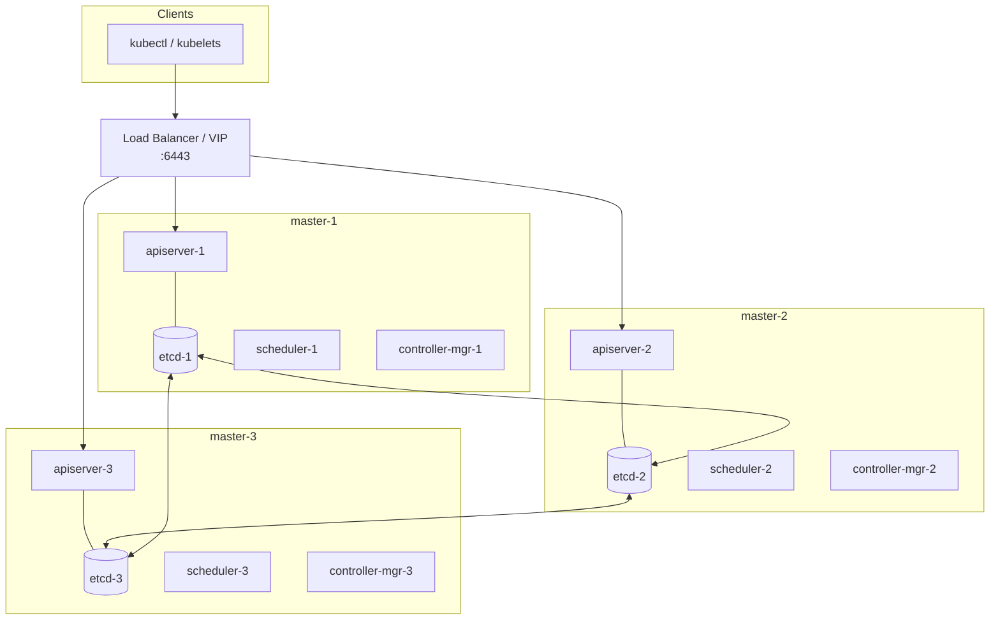

# Kubernetes Multi-Master (HA Control Plane) Troubleshooting Guide

A focused reference for diagnosing and fixing problems specific to
**high-availability clusters with multiple control-plane (master) nodes** —
etcd quorum, API server load balancing, leader election, certificate/SAN
issues, and split-brain recovery.

> For general Pod/node/networking issues, see the companion
> [Kubernetes Comprehensive Troubleshooting Guide](kubernetes-troubleshooting-guide.md).

---

## Table of Contents

- [Kubernetes Multi-Master (HA Control Plane) Troubleshooting Cheat Sheet](#kubernetes-multi-master-ha-control-plane-troubleshooting-cheat-sheet)
  - [Table of Contents](#table-of-contents)
  - [1. HA Control Plane Architecture](#1-ha-control-plane-architecture)
  - [2. Quick Health Check Commands](#2-quick-health-check-commands)
  - [3. etcd Quorum \& Cluster Membership](#3-etcd-quorum--cluster-membership)
  - [4. API Server Load Balancer / VIP](#4-api-server-load-balancer--vip)
  - [5. Leader Election](#5-leader-election)
  - [6. Certificates \& SANs](#6-certificates--sans)
  - [7. Adding / Removing Control-Plane Nodes](#7-adding--removing-control-plane-nodes)
    - [Add a master (kubeadm)](#add-a-master-kubeadm)
    - [Remove a master cleanly (ORDER MATTERS)](#remove-a-master-cleanly-order-matters)
  - [8. Split-Brain \& Quorum Loss Recovery](#8-split-brain--quorum-loss-recovery)
    - [When you've lost quorum (e.g., 2 of 3 masters down)](#when-youve-lost-quorum-eg-2-of-3-masters-down)
    - [Split-brain prevention](#split-brain-prevention)
  - [9. etcd Backup \& Restore](#9-etcd-backup--restore)
  - [10. Stacked vs External etcd](#10-stacked-vs-external-etcd)
  - [11. Common Failure Scenarios → Fix](#11-common-failure-scenarios--fix)
    - [etcd compaction \& defrag (fixing NOSPACE / large DB)](#etcd-compaction--defrag-fixing-nospace--large-db)
    - [Golden rules for multi-master clusters](#golden-rules-for-multi-master-clusters)

---

## 1. HA Control Plane Architecture

A multi-master cluster runs the control-plane components on 3+ nodes (odd
numbers preferred) behind a load balancer. Worker kubelets and `kubectl` talk to
a single **stable endpoint** (the LB/VIP), which fans out to healthy API servers.



Key HA facts:
- **API servers are stateless and active-active** — all serve traffic; the LB
  spreads requests. State lives in etcd.
- **etcd is a Raft cluster** — needs a **quorum (majority)** to accept writes.
  3 nodes tolerate 1 failure; 5 tolerate 2. Even numbers add no fault tolerance.
- **Scheduler and controller-manager are active-passive** — only the elected
  leader is active; others stand by via a lease.
- The **control-plane endpoint must be stable** (LB/DNS/VIP), never a single
  master's IP.

---

## 2. Quick Health Check Commands

```bash
# Control-plane pods on every master
kubectl get pods -n kube-system -o wide \
  -l tier=control-plane

# Are all control-plane nodes Ready?
kubectl get nodes -l node-role.kubernetes.io/control-plane

# Who holds the leader leases right now?
kubectl get lease -n kube-system kube-scheduler kube-controller-manager \
  -o jsonpath='{range .items[*]}{.metadata.name}{": "}{.spec.holderIdentity}{"\n"}{end}'

# API server reachability through the LB/VIP
kubectl cluster-info
curl -k https://<control-plane-endpoint>:6443/healthz      # expect: ok
curl -k https://<control-plane-endpoint>:6443/readyz?verbose

# Hit each API server directly (bypass the LB) to isolate a bad backend
for ip in <m1> <m2> <m3>; do
  echo "== $ip =="; curl -sk https://$ip:6443/healthz; echo
done
```

---

## 3. etcd Quorum & Cluster Membership

The single most important HA concern: **without etcd quorum, the API server
goes read-only/unavailable and the whole cluster freezes.**

```bash
# Set up env once (paths are kubeadm defaults)
export ETCDCTL_API=3
export EP=https://127.0.0.1:2379
export CERTS="--cacert=/etc/kubernetes/pki/etcd/ca.crt \
  --cert=/etc/kubernetes/pki/etcd/server.crt \
  --key=/etc/kubernetes/pki/etcd/server.key"

# Per-member health (run on a master, or list all endpoints)
etcdctl $CERTS --endpoints=$EP endpoint health
etcdctl $CERTS --endpoints=https://<m1>:2379,https://<m2>:2379,https://<m3>:2379 \
  endpoint health --cluster

# Membership + who is the leader
etcdctl $CERTS --endpoints=$EP member list -w table
etcdctl $CERTS --endpoints=https://<m1>:2379,https://<m2>:2379,https://<m3>:2379 \
  endpoint status -w table     # IS LEADER column, RAFT TERM, DB SIZE
```

Read the `endpoint status` table:
- **IS LEADER** — exactly one member should be `true`. None/flapping = trouble.
- **RAFT TERM** — should match across members and be stable. Rapidly increasing
  term = repeated elections (network flakiness, slow disk).
- **DB SIZE** — near the 2 GB default quota → needs compaction/defrag.
- **ERRORS** column — alarms like `NOSPACE`.

Quorum math:

| etcd members | Quorum needed | Failures tolerated |
|---|---|---|
| 1 | 1 | 0 |
| 3 | 2 | 1 |
| 5 | 3 | 2 |
| 7 | 4 | 3 |

> Always use an **odd** number. Going from 3→4 members *lowers* effective
> resilience (still tolerates only 1 failure but more things can break).

Symptoms of quorum loss:
- `etcdserver: request timed out` / `context deadline exceeded` in apiserver logs.
- `kubectl` writes hang or fail; reads may also fail.
- API server `readyz` shows `etcd` check failing.

---

## 4. API Server Load Balancer / VIP

All clients use one endpoint; a broken LB makes the cluster *look* down even when
masters are healthy.

```bash
# What endpoint do clients use? (server: field)
kubectl config view --minify -o jsonpath='{.clusters[0].cluster.server}'; echo

# kubeadm-configured control-plane endpoint
kubectl -n kube-system get configmap kubeadm-config -o yaml | grep controlPlaneEndpoint
```

Checklist:
- LB health check should probe `GET /healthz` (or `/readyz`) on **TCP/HTTPS
  6443**, not just a TCP connect — a hung apiserver still accepts TCP.
- Ensure the LB removes an unhealthy backend; test by curling each master
  directly (section 2).
- **VIP solutions** (keepalived + haproxy, kube-vip): confirm the VIP is bound to
  exactly one node and fails over.
  ```bash
  ip addr show | grep <vip>            # On each master — VIP on only one
  systemctl status keepalived haproxy  # Or: kubectl get pods -n kube-system -l app=kube-vip
  journalctl -u keepalived -f          # Watch for MASTER/BACKUP transitions
  ```
- Certificate SAN must include the LB/VIP address and hostname (section 6),
  otherwise clients get `x509: certificate is valid for … not <endpoint>`.
- Split-DNS/round-robin DNS without health awareness sends traffic to dead
  masters — prefer a real LB or VIP.

---

## 5. Leader Election

`kube-scheduler` and `kube-controller-manager` run on every master but only the
**leader** acts. Leadership is tracked by a `Lease` object.

```bash
kubectl get lease -n kube-system \
  kube-scheduler kube-controller-manager -o wide

kubectl get lease -n kube-system kube-controller-manager \
  -o jsonpath='{.spec.holderIdentity}{"\n"}'
```

Troubleshooting:
- **No leader / constant re-election** — usually etcd/apiserver latency. Check
  etcd `RAFT TERM` churn and apiserver logs. Leases renew every couple seconds;
  if writes are slow, the lease expires and another instance takes over,
  causing flapping (scheduling/controller actions stall).
- **Pods not being scheduled** even though nodes have capacity → scheduler leader
  may be wedged. Check the holder's logs:
  ```bash
  kubectl logs -n kube-system kube-scheduler-<leader-node>
  ```
- **Endpoints/replicas not reconciling** → controller-manager leader issue;
  inspect its logs on the lease holder node.
- After replacing a master, the old holder identity may linger until the lease
  expires (`leaseDurationSeconds`, default ~15s) — brief, self-healing.

---

## 6. Certificates & SANs

HA introduces extra names that **every** API server cert must cover: the LB/VIP
IP, the control-plane DNS name, and each master's IP/hostname.

```bash
# Check expiry across all control-plane & etcd certs (run on each master)
kubeadm certs check-expiration

# Inspect the API server cert's SANs
openssl x509 -in /etc/kubernetes/pki/apiserver.crt -noout -text \
  | grep -A1 'Subject Alternative Name'
```

Common HA cert problems:
- Missing SAN for the LB/VIP or control-plane DNS → `x509: certificate is valid
  for <names>, not <endpoint>`. Regenerate the apiserver cert with the extra SAN:
  ```bash
  # Add to kubeadm config: apiServer.certSANs: [<vip>, <dns>, <m1>, <m2>, <m3>]
  mv /etc/kubernetes/pki/apiserver.{crt,key} /tmp/   # back up & remove
  kubeadm init phase certs apiserver --config kubeadm-config.yaml
  # restart the apiserver static pod (kill the container / move the manifest)
  ```
- **Certs out of sync between masters** — each master has its own certs; a
  manually renewed cert on one node but not others causes intermittent TLS
  failures depending on which backend the LB picks.
- etcd peer certs must list every etcd member's IP, or peers reject each other.
- Expired certs cause cluster-wide auth failure → `kubeadm certs renew all` on
  **each** master, then restart control-plane pods/kubelet.

---

## 7. Adding / Removing Control-Plane Nodes

### Add a master (kubeadm)

```bash
# On an existing master: upload certs and get the join command
kubeadm init phase upload-certs --upload-certs        # prints certificate key
kubeadm token create --print-join-command             # base worker join cmd

# On the new master: append the control-plane flags
kubeadm join <control-plane-endpoint>:6443 \
  --token <token> --discovery-token-ca-cert-hash sha256:<hash> \
  --control-plane --certificate-key <cert-key>
```

After joining, verify the new etcd member registered and is healthy:

```bash
etcdctl $CERTS --endpoints=$EP member list -w table
kubectl get nodes -l node-role.kubernetes.io/control-plane
```

### Remove a master cleanly (ORDER MATTERS)

Removing a master without first removing its etcd member can break quorum.

```bash
# 1) Remove the etcd member FIRST (find its ID, then remove)
etcdctl $CERTS --endpoints=$EP member list
etcdctl $CERTS --endpoints=$EP member remove <member-id-hex>

# 2) Drain and delete the node
kubectl drain <master> --ignore-daemonsets --delete-emptydir-data
kubectl delete node <master>

# 3) On the removed node, clean up
kubeadm reset
```

> Always keep an odd number of healthy masters. Remove/replace one at a time and
> confirm quorum (`endpoint health --cluster`) before touching the next.

---

## 8. Split-Brain & Quorum Loss Recovery

### When you've lost quorum (e.g., 2 of 3 masters down)

The surviving member alone **cannot** form a majority, so etcd is read-only. You
must either restore a failed member or force a single-node cluster.

```bash
# Confirm the situation
etcdctl $CERTS --endpoints=$EP endpoint status -w table   # likely errors/timeouts
etcdctl $CERTS --endpoints=$EP member list                # shows dead members
```

**Option A — Restore failed members (preferred):** bring the down masters back so
quorum returns naturally. If a member's data is corrupt, remove it and re-add:

```bash
etcdctl $CERTS --endpoints=$EP member remove <dead-member-id>
# Then re-join that master (section 7) so it re-syncs from the leader.
```

**Option B — Force a new single-member cluster (last resort, DATA RISK):** when
only one member survives and you cannot recover the others, restart that etcd
with `--force-new-cluster`, then re-add masters.

```bash
# Edit /etc/kubernetes/manifests/etcd.yaml on the survivor and add:
#   - --force-new-cluster
# kubelet auto-restarts the static pod. Once healthy, REMOVE the flag again,
# then re-join the other masters fresh.
```

### Split-brain prevention
- Never run an **even** number of etcd members across two failure domains/zones
  — a network partition can leave neither side with majority (or both thinking
  they're authoritative if misconfigured).
- Spread 3/5 members across **3+ failure domains** so one zone outage keeps
  quorum.
- Use the VIP/LB health checks so clients never write to an isolated minority
  apiserver.

---

## 9. etcd Backup & Restore

Your HA cluster is only as safe as your last etcd snapshot. Back up regularly.

```bash
# Snapshot (run on any healthy member)
etcdctl $CERTS --endpoints=$EP snapshot save /backup/etcd-$(date +%F).db
etcdctl --write-out=table snapshot status /backup/etcd-YYYY-MM-DD.db

# Restore (stop apiserver + etcd static pods first on ALL masters)
ETCDCTL_API=3 etcdutl snapshot restore /backup/etcd-YYYY-MM-DD.db \
  --name <member-name> \
  --initial-cluster <m1>=https://<ip1>:2380,<m2>=https://<ip2>:2380,<m3>=https://<ip3>:2380 \
  --initial-advertise-peer-urls https://<this-ip>:2380 \
  --data-dir /var/lib/etcd-restored
# Point etcd.yaml's --data-dir at the restored dir, repeat per master, restart.
```

Restore rules:
- Restore the **same snapshot** to every master with matching `--initial-cluster`.
- Stop the control plane during restore to avoid writes to a moving target.
- After restore, verify `member list`, leader election, and that workloads match
  the snapshot's point in time.
- `etcdctl snapshot restore` is deprecated in newer versions — use `etcdutl`.

---

## 10. Stacked vs External etcd

| Aspect | Stacked (etcd on masters) | External etcd cluster |
|---|---|---|
| Topology | etcd co-located with control plane | Dedicated etcd nodes |
| Failure blast radius | Losing a master loses an etcd member | Control plane & etcd fail independently |
| Setup complexity | Simpler (kubeadm default) | More nodes/certs to manage |
| Recovery | Tied to the master node | Restore etcd without touching apiservers |

Diagnostics differ slightly:
- **Stacked**: etcd is a static pod (`/etc/kubernetes/manifests/etcd.yaml`);
  logs via `crictl logs` or `kubectl logs -n kube-system etcd-<node>`.
- **External**: etcd runs as a systemd service on its own hosts;
  `systemctl status etcd`, `journalctl -u etcd`. The apiserver's
  `--etcd-servers` flag lists the external endpoints — verify connectivity from
  every master.

---

## 11. Common Failure Scenarios → Fix

| Symptom | Likely cause | First action |
|---|---|---|
| `kubectl` hangs on writes, reads sometimes work | etcd quorum lost | `etcdctl endpoint status --cluster`; restore members |
| `etcdserver: request timed out` in apiserver logs | Slow etcd disk or election churn | Check disk fsync latency, `RAFT TERM` |
| `x509: certificate is valid for …, not <endpoint>` | LB/VIP missing from cert SAN | Regenerate apiserver cert with certSANs |
| Cluster unreachable but masters are up | LB/VIP down or misrouting | Check keepalived/haproxy/kube-vip, curl masters directly |
| Works via one master, fails via another | Out-of-sync certs or one bad backend | curl each apiserver; compare certs/versions |
| Pods not scheduled despite free capacity | Scheduler leader wedged | Check lease holder + scheduler logs |
| Endpoints/replicas not updating | Controller-manager leader issue | Check lease holder + controller-mgr logs |
| New master won't join | Cert key expired / token invalid | `upload-certs` again, new join token |
| Removed a master, cluster degraded | etcd member not removed first | `member remove` the stale member |
| Constant leader re-election (flapping) | etcd/apiserver latency, clock skew | Stabilize etcd disk/network, sync NTP |
| etcd `NOSPACE` alarm | DB exceeded quota | Compact + defrag, then `alarm disarm` |

### etcd compaction & defrag (fixing NOSPACE / large DB)

```bash
# Compact up to the current revision
rev=$(etcdctl $CERTS --endpoints=$EP endpoint status -w json | grep -o '"revision":[0-9]*' | head -1 | cut -d: -f2)
etcdctl $CERTS --endpoints=$EP compact $rev
# Defrag each member (do one at a time)
etcdctl $CERTS --endpoints=$EP defrag
# Clear the space alarm
etcdctl $CERTS --endpoints=$EP alarm list
etcdctl $CERTS --endpoints=$EP alarm disarm
```

---

### Golden rules for multi-master clusters

- **Odd number of etcd members**, spread across failure domains.
- **One stable control-plane endpoint** (LB/VIP) with real health checks.
- **Back up etcd** on a schedule and test restores.
- **Change one master at a time**; verify quorum before the next.
- **Keep certs in sync and monitored** for expiry across all masters.
- **Watch leader leases and `RAFT TERM`** as early warning signs of instability.
