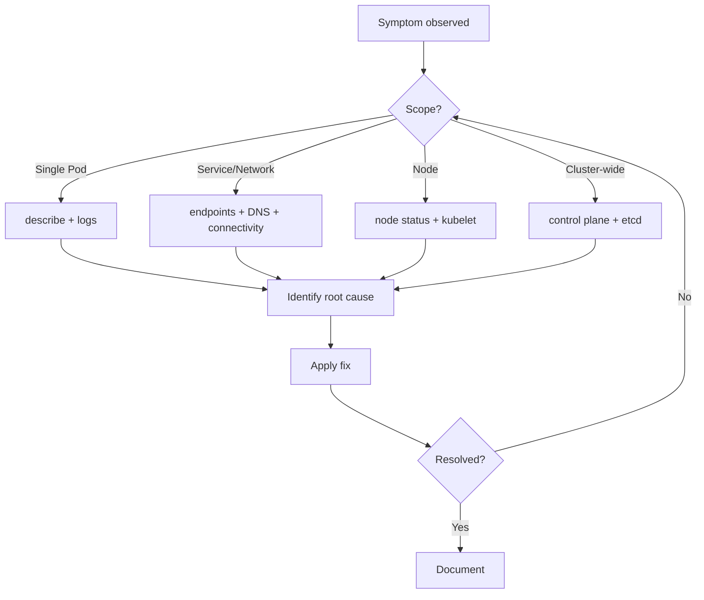

# Kubernetes Comprehensive Troubleshooting Guide

A practical, end-to-end reference for diagnosing and fixing problems across the
Kubernetes stack — Pods, workloads, networking, storage, control plane, nodes,
RBAC, and observability.

---

## Table of Contents

- [Kubernetes Comprehensive Troubleshooting Guide](#kubernetes-comprehensive-troubleshooting-guide)
  - [Table of Contents](#table-of-contents)
  - [1. Troubleshooting Methodology](#1-troubleshooting-methodology)
  - [2. Essential Commands Cheat Sheet](#2-essential-commands-cheat-sheet)
  - [3. Pod \& Container Issues](#3-pod--container-issues)
    - [Pod statuses and what they mean](#pod-statuses-and-what-they-mean)
    - [CrashLoopBackOff](#crashloopbackoff)
    - [ImagePullBackOff / ErrImagePull](#imagepullbackoff--errimagepull)
    - [Pod stuck in Pending](#pod-stuck-in-pending)
    - [Pod stuck Terminating](#pod-stuck-terminating)
    - [Readiness vs Liveness vs Startup probes](#readiness-vs-liveness-vs-startup-probes)
  - [4. Workload Controllers](#4-workload-controllers)
    - [Deployments](#deployments)
    - [StatefulSets](#statefulsets)
    - [DaemonSets](#daemonsets)
    - [Jobs \& CronJobs](#jobs--cronjobs)
  - [5. Networking \& Service Discovery](#5-networking--service-discovery)
    - [Service has no endpoints](#service-has-no-endpoints)
    - [Testing connectivity](#testing-connectivity)
    - [Service types recap](#service-types-recap)
    - [NetworkPolicies](#networkpolicies)
  - [6. DNS Issues](#6-dns-issues)
  - [7. Ingress \& Load Balancing](#7-ingress--load-balancing)
  - [8. Storage \& Persistent Volumes](#8-storage--persistent-volumes)
    - [PVC stuck in Pending](#pvc-stuck-in-pending)
    - [Mount failures](#mount-failures)
    - [Access modes](#access-modes)
  - [9. Node Issues](#9-node-issues)
    - [NotReady nodes](#notready-nodes)
      - [Network / CNI plugin not ready](#network--cni-plugin-not-ready)
      - [Disk full](#disk-full)
      - [Expired certificates](#expired-certificates)
      - [Clock skew](#clock-skew)
      - [Node lost connectivity to the API server](#node-lost-connectivity-to-the-api-server)
    - [Cordon, drain, uncordon](#cordon-drain-uncordon)
    - [Taints \& tolerations](#taints--tolerations)
  - [10. Resource Management](#10-resource-management)
    - [OOMKilled (exit code 137)](#oomkilled-exit-code-137)
    - [Requests vs Limits](#requests-vs-limits)
    - [QoS classes](#qos-classes)
    - [CPU throttling](#cpu-throttling)
    - [Quotas \& LimitRanges](#quotas--limitranges)
  - [11. Scheduling Problems](#11-scheduling-problems)
  - [12. RBAC \& Authentication](#12-rbac--authentication)
  - [13. Control Plane Components](#13-control-plane-components)
    - [etcd health](#etcd-health)
    - [Certificate expiry](#certificate-expiry)
  - [14. ConfigMaps, Secrets \& Environment](#14-configmaps-secrets--environment)
  - [15. Image \& Registry Issues](#15-image--registry-issues)
  - [16. Observability \& Logging](#16-observability--logging)
  - [17. Quick Symptom → Cause Reference](#17-quick-symptom--cause-reference)
    - [General principles](#general-principles)

---

## 1. Troubleshooting Methodology

Follow a structured approach instead of randomly running commands.

1. **Identify scope** — Is it one Pod, one node, one namespace, or cluster-wide?
2. **Check status** — `kubectl get` to see the current state.
3. **Read events** — `kubectl describe` and `kubectl get events` reveal *why*.
4. **Inspect logs** — `kubectl logs` for application-level errors.
5. **Reproduce** — Confirm the failure is consistent.
6. **Isolate the layer** — App → Pod → Service → Network → Node → Control plane.
7. **Fix & verify** — Apply a change, then confirm the symptom is gone.
8. **Document** — Record root cause to prevent recurrence.



---

## 2. Essential Commands Cheat Sheet

```bash
# Overview
kubectl get all -A                          # Everything across namespaces
kubectl get pods -o wide                    # Pods with node/IP info
kubectl get events -A --sort-by=.lastTimestamp

# Deep inspection
kubectl describe pod <pod>                  # Events, conditions, mounts
kubectl logs <pod> [-c <container>]         # Container logs
kubectl logs <pod> --previous               # Logs from crashed container
kubectl logs -f <pod>                       # Follow logs

# Debugging live
kubectl exec -it <pod> -- sh                # Shell into a container
kubectl debug <pod> -it --image=busybox \
  --target=<container>                      # Ephemeral debug container
kubectl debug node/<node> -it \
  --image=ubuntu                            # Debug a node

# Resource usage (needs metrics-server)
kubectl top pods -A
kubectl top nodes

# YAML/JSON output for raw state
kubectl get pod <pod> -o yaml
kubectl get pod <pod> -o jsonpath='{.status.phase}'

# API & cluster health
kubectl cluster-info
kubectl get componentstatuses
kubectl api-resources
```

---

## 3. Pod & Container Issues

### Pod statuses and what they mean

| Status | Meaning | First check |
|---|---|---|
| `Pending` | Not yet scheduled or waiting on resources | `describe` events, scheduling |
| `ContainerCreating` | Pulling image / mounting volumes | image pull, volume mounts |
| `CrashLoopBackOff` | Container starts then exits repeatedly | `logs --previous`, exit code |
| `ImagePullBackOff` / `ErrImagePull` | Cannot pull image | image name, registry creds |
| `Error` / `Failed` | Container exited non-zero | logs, exit code |
| `Terminating` (stuck) | Finalizers or graceful shutdown hang | finalizers, `--force` |
| `Completed` | Job/one-shot container finished | expected for Jobs |
| `Running` but not Ready | Readiness probe failing | probe config, app health |

### CrashLoopBackOff

```bash
kubectl describe pod <pod>                  # Look at "Last State" + exit code
kubectl logs <pod> --previous               # Logs from the crashed instance
kubectl get pod <pod> -o jsonpath='{.status.containerStatuses[0].lastState.terminated.exitCode}'
```

Common exit codes:
- **0** — Clean exit (often a misconfigured command that just runs and stops).
- **1** — Generic application error (check logs).
- **137** — SIGKILL, usually **OOMKilled** (out of memory) or failed liveness probe.
- **139** — SIGSEGV, segmentation fault in the app.
- **143** — SIGTERM, graceful termination.

Typical causes & fixes:
- Wrong `command`/`args` or entrypoint → fix container spec.
- Missing config/secret/env var → check mounts and references.
- Failing liveness probe killing a healthy-but-slow app → increase
  `initialDelaySeconds` / `timeoutSeconds`.
- App can't reach a dependency (DB, API) → fix networking / startup order.
- OOMKilled → raise memory limits or fix a leak.

### ImagePullBackOff / ErrImagePull

```bash
kubectl describe pod <pod> | grep -A5 Events
```

Causes & fixes:
- Typo in image name/tag → correct `image:` field.
- Private registry without credentials → create and reference an
  `imagePullSecret`:

```bash
kubectl create secret docker-registry regcred \
  --docker-server=<registry> \
  --docker-username=<user> \
  --docker-password=<password>
```

```yaml
spec:
  imagePullSecrets:
    - name: regcred
```

- Rate limiting (e.g., Docker Hub) → use authenticated pulls or a mirror.
- `imagePullPolicy: Always` with no network → check node connectivity.

### Pod stuck in Pending

```bash
kubectl describe pod <pod>     # Read the Events section carefully
```

Causes:
- Insufficient CPU/memory on all nodes → scale nodes or lower requests.
- No node matches `nodeSelector` / affinity / taints → adjust constraints.
- Unbound PVC → see [Storage](#8-storage--persistent-volumes).
- Pod exceeds namespace ResourceQuota / LimitRange.

### Pod stuck Terminating

```bash
kubectl get pod <pod> -o yaml | grep -A5 finalizers
kubectl delete pod <pod> --grace-period=0 --force   # Last resort
```

Causes: hung finalizer, unresponsive node, volume that won't unmount, or a
process ignoring SIGTERM.

### Readiness vs Liveness vs Startup probes

- **Liveness** — restarts the container if it fails. Misuse causes restart loops.
- **Readiness** — removes the Pod from Service endpoints if it fails. Misuse
  causes "Running but no traffic".
- **Startup** — protects slow-starting apps; disables liveness until it passes.

```bash
kubectl get pod <pod> -o jsonpath='{.spec.containers[0].livenessProbe}'
```

---

## 4. Workload Controllers

### Deployments

```bash
kubectl rollout status deployment/<name>
kubectl rollout history deployment/<name>
kubectl rollout undo deployment/<name>            # Roll back
kubectl rollout undo deployment/<name> --to-revision=2
kubectl describe deployment <name>
```

Stuck rollout causes:
- New ReplicaSet Pods failing (image, probes, resources).
- `maxUnavailable`/`maxSurge` too strict for available capacity.
- `progressDeadlineSeconds` exceeded → check the new Pods.

### StatefulSets

- Pods are created/updated **in order** (0,1,2…). One stuck Pod blocks the rest.
- Each replica needs its own PVC (via `volumeClaimTemplates`); a missing PV
  blocks the Pod.
- Headless Service must exist for stable network identities.

```bash
kubectl get statefulset <name> -o wide
kubectl get pvc -l app=<label>
```

### DaemonSets

- Should run one Pod per (eligible) node. Missing Pods → check node taints and
  the DaemonSet's tolerations / nodeSelector.

```bash
kubectl get daemonset <name>
kubectl describe daemonset <name>
```

### Jobs & CronJobs

```bash
kubectl get jobs
kubectl describe job <name>
kubectl get cronjob <name>
kubectl logs job/<name>
```

- Job not completing → check `backoffLimit`, Pod logs, exit codes.
- CronJob not firing → check `schedule`, `suspend: false`, timezone, and
  `startingDeadlineSeconds`. `concurrencyPolicy` may be skipping runs.

---

## 5. Networking & Service Discovery

### Service has no endpoints

This is the most common networking bug. A Service with no endpoints routes
nowhere.

```bash
kubectl get endpoints <service>          # Should list Pod IPs
kubectl get endpointslices -l kubernetes.io/service-name=<service>
kubectl describe service <service>
```

Root cause is almost always a **selector mismatch** — the Service `selector`
labels don't match the Pod labels, or the Pods aren't Ready.

```bash
kubectl get pods --show-labels
kubectl get service <service> -o jsonpath='{.spec.selector}'
```

Also verify `targetPort` matches the container's actual listening port.

### Testing connectivity

```bash
# From inside a debug pod
kubectl run nettest --rm -it --image=nicolaka/netshoot -- sh

# Inside it:
curl http://<service>.<namespace>.svc.cluster.local:<port>
nslookup <service>.<namespace>
ping <pod-ip>
nc -zv <service> <port>
```

### Service types recap

| Type | Reachable from | Common issue |
|---|---|---|
| `ClusterIP` | Inside cluster only | selector mismatch, wrong port |
| `NodePort` | `<nodeIP>:<30000-32767>` | firewall, wrong node IP |
| `LoadBalancer` | External LB IP | cloud provider, pending EXTERNAL-IP |
| `ExternalName` | CNAME redirect | DNS resolution |

`LoadBalancer` stuck in `<pending>` → cloud controller manager not installed,
quota exhausted, or no cloud integration (bare metal needs MetalLB).

### NetworkPolicies

A `default-deny` NetworkPolicy will silently block traffic.

```bash
kubectl get networkpolicy -A
kubectl describe networkpolicy <name>
```

Confirm ingress/egress rules allow the required namespaces/pods/ports. Remember
NetworkPolicies are **additive** (allow-lists) and require a CNI that supports
them (Calico, Cilium, etc.).

---

## 6. DNS Issues

DNS failures look like app errors ("host not found", connection timeouts).

```bash
# Is CoreDNS healthy?
kubectl get pods -n kube-system -l k8s-app=kube-dns
kubectl logs -n kube-system -l k8s-app=kube-dns

# Test resolution from a pod
kubectl run dnstest --rm -it --image=busybox:1.28 -- nslookup kubernetes.default
```

Common causes:
- CoreDNS Pods crashing or under-resourced.
- `/etc/resolv.conf` misconfigured (`ndots:5` causing slow lookups).
- NetworkPolicy blocking egress to `kube-dns` (UDP/TCP 53).
- Upstream resolver unreachable for external names.

FQDN format: `<service>.<namespace>.svc.cluster.local`.

---

## 7. Ingress & Load Balancing

```bash
kubectl get ingress
kubectl describe ingress <name>
kubectl get pods -n <ingress-controller-namespace>
kubectl logs -n <ns> <ingress-controller-pod>
```

Checklist:
- An **Ingress Controller** (nginx, Traefik, etc.) must be installed — Ingress
  objects do nothing without one.
- `ingressClassName` must match the installed controller.
- Backend Service must exist and have endpoints.
- TLS secret referenced must exist and be valid.
- Path types (`Prefix` vs `Exact`) and rewrite annotations matter.
- 502/503 → backend Pods unhealthy or wrong `servicePort`.
- 404 → host/path rule mismatch.

---

## 8. Storage & Persistent Volumes

```bash
kubectl get pvc
kubectl get pv
kubectl describe pvc <name>
kubectl get storageclass
```

### PVC stuck in Pending

Causes & fixes:
- No `StorageClass` / no default StorageClass → set one as default:
  ```bash
  kubectl patch storageclass <name> -p \
    '{"metadata":{"annotations":{"storageclass.kubernetes.io/is-default-class":"true"}}}'
  ```
- No provisioner / CSI driver installed → install the cloud or local CSI driver.
- No PV matches the requested size/accessModes (for static provisioning).
- Zone mismatch — PV in a different zone than the Pod's node.

### Mount failures

```bash
kubectl describe pod <pod>     # "FailedMount" / "FailedAttachVolume" events
```

- `ReadWriteOnce` volume can't attach to multiple nodes at once → use
  `ReadWriteMany` (NFS, CephFS) or co-locate Pods.
- Volume still attached to a dead node → may need manual detach.
- Permissions: set `securityContext.fsGroup` so the app can write.

### Access modes

| Mode | Meaning |
|---|---|
| `ReadWriteOnce` (RWO) | Mounted read-write by a single node |
| `ReadOnlyMany` (ROX) | Read-only by many nodes |
| `ReadWriteMany` (RWX) | Read-write by many nodes (needs supporting backend) |
| `ReadWriteOncePod` | Read-write by a single Pod |

---

## 9. Node Issues

```bash
kubectl get nodes
kubectl describe node <node>
kubectl top nodes
```

### NotReady nodes

```bash
kubectl describe node <node> | grep -A10 Conditions
```

Node conditions to watch:
- `MemoryPressure` / `DiskPressure` / `PIDPressure` — node is resource-starved;
  kubelet starts evicting Pods.
- `Ready=False` — kubelet not reporting. Check kubelet on the node:
  ```bash
  systemctl status kubelet
  journalctl -u kubelet -f
  ```

Common root causes:
- kubelet crashed or misconfigured.
- Container runtime (containerd/CRI-O) down: `systemctl status containerd`.

#### Network / CNI plugin not ready

If the CNI plugin fails to initialize, the kubelet reports
`NetworkPluginNotReady` and the node stays `NotReady` because Pods can't be
assigned an IP. New Pods get stuck in `ContainerCreating`.

```bash
# Are the CNI agent Pods (Calico, Cilium, Flannel, etc.) healthy?
kubectl get pods -n kube-system -o wide | grep -Ei 'calico|cilium|flannel|weave|cni'
kubectl describe node <node> | grep -i networkplugin

# On the node — confirm the CNI config and binaries exist
ls /etc/cni/net.d/                 # Should contain a *.conf / *.conflist
ls /opt/cni/bin/                   # Should contain the plugin binaries
journalctl -u kubelet | grep -i cni
```

Fixes:
- Re-deploy or restart the CNI DaemonSet (`kubectl rollout restart daemonset/<cni> -n kube-system`).
- Ensure exactly **one** CNI config is in `/etc/cni/net.d/` (multiple configs conflict).
- Verify the Pod CIDR matches the CNI's configured range.
- Check that required kernel modules (e.g. `br_netfilter`) are loaded and
  `net.bridge.bridge-nf-call-iptables=1` is set.

#### Disk full

`DiskPressure` triggers when the node's image or root filesystem crosses the
kubelet eviction threshold (default ~85% / `nodefs.available<10%`). The kubelet
evicts Pods and garbage-collects images; if it can't recover space, the node
goes `NotReady`.

```bash
# On the node
df -h /var/lib/kubelet /var/lib/containerd /var      # Find the full mount
du -sh /var/lib/containerd/* 2>/dev/null | sort -h   # Largest consumers
crictl images                                        # Unused images
journalctl --disk-usage                              # Bloated system logs
```

Fixes:
- Prune unused images/containers: `crictl rmi --prune`.
- Rotate or vacuum logs: `journalctl --vacuum-size=500M`.
- Clear orphaned Pod logs under `/var/log/pods` and `/var/lib/kubelet`.
- Grow the disk/volume, or move container storage to a larger filesystem.

#### Expired certificates

The kubelet uses a client certificate (default valid ~1 year) to talk to the API
server. When it expires, the node abruptly drops to `NotReady` with TLS / `x509:
certificate has expired` errors in the kubelet log.

```bash
journalctl -u kubelet | grep -i x509
# Inspect the kubelet client cert expiry
openssl x509 -enddate -noout -in /var/lib/kubelet/pki/kubelet-client-current.pem
# Control-plane certs (kubeadm)
kubeadm certs check-expiration
```

Fixes:
- Enable kubelet cert rotation (`--rotate-certificates`) so it renews
  automatically.
- Renew control-plane certs: `kubeadm certs renew all`, then restart the static
  control-plane Pods / kubelet.
- If the kubelet client cert is gone, delete the stale cert and restart the
  kubelet so it re-bootstraps via the bootstrap token.

#### Clock skew

Significant time drift between a node and the control plane breaks TLS
validation (certs appear "not yet valid" or "expired"), causing intermittent
auth failures and `NotReady` flapping.

```bash
timedatectl status            # Check NTP sync state and offset
chronyc tracking              # If using chrony
```

Fixes: enable and sync NTP/chrony, then restart the kubelet.

#### Node lost connectivity to the API server

If the kubelet can't reach the API server, it stops sending heartbeats
(node leases) and the controller marks the node `NotReady` after
`node-monitor-grace-period` (~40s). The node and its Pods may still be running.

```bash
# From the node — can it reach the API server?
curl -k https://<apiserver>:6443/healthz
ping <apiserver-ip>
journalctl -u kubelet | grep -iE 'connection refused|timeout|dial tcp'
```

Causes & fixes:
- Firewall / security group blocking port 6443 → open it.
- Wrong API server address in `/etc/kubernetes/kubelet.conf` → correct and
  restart the kubelet.
- Control-plane load balancer or VIP down → restore it.
- DNS failure resolving the API server hostname → fix node DNS / `/etc/hosts`.

### Cordon, drain, uncordon

```bash
kubectl cordon <node>                     # Mark unschedulable
kubectl drain <node> --ignore-daemonsets --delete-emptydir-data
kubectl uncordon <node>                   # Re-enable scheduling
```

### Taints & tolerations

```bash
kubectl describe node <node> | grep Taints
kubectl taint nodes <node> key=value:NoSchedule-     # Remove a taint
```

A NotReady node automatically gets `node.kubernetes.io/not-ready:NoExecute`,
which evicts Pods lacking the matching toleration.

---

## 10. Resource Management

### OOMKilled (exit code 137)

```bash
kubectl get pod <pod> -o jsonpath='{.status.containerStatuses[0].lastState.terminated.reason}'
kubectl describe pod <pod> | grep -i oom
```

Fixes:
- Increase `resources.limits.memory`.
- Fix a memory leak in the app.
- Ensure `requests` reflect real usage so the scheduler places Pods correctly.

### Requests vs Limits

- **requests** — guaranteed minimum; used by the scheduler for placement.
- **limits** — hard ceiling; exceeding memory limit → OOMKill, exceeding CPU
  limit → throttling (not killed).

### QoS classes

| QoS | Condition | Eviction priority |
|---|---|---|
| `Guaranteed` | requests == limits for all containers | Evicted last |
| `Burstable` | requests < limits | Middle |
| `BestEffort` | no requests/limits | Evicted first |

```bash
kubectl get pod <pod> -o jsonpath='{.status.qosClass}'
```

### CPU throttling

High latency with CPU usage capped at the limit indicates throttling. Check
`container_cpu_cfs_throttled_periods_total` in metrics, and raise CPU limits.

### Quotas & LimitRanges

```bash
kubectl get resourcequota -A
kubectl describe resourcequota <name> -n <ns>
kubectl get limitrange -A
```

A Pod that omits requests/limits can be rejected by a LimitRange or count
against a ResourceQuota.

---

## 11. Scheduling Problems

```bash
kubectl describe pod <pod>     # FailedScheduling events explain why
```

Common scheduler messages and meaning:
- `0/N nodes are available: insufficient cpu/memory` → scale out or lower requests.
- `node(s) had taint {…} that the pod didn't tolerate` → add tolerations.
- `node(s) didn't match Pod's node affinity/selector` → fix labels/affinity.
- `node(s) had volume node affinity conflict` → PV/zone mismatch.
- `node(s) didn't match pod anti-affinity rules` → relax anti-affinity.

Tools:
- `nodeSelector` — simple label match.
- `nodeAffinity` — required/preferred rules.
- `podAffinity` / `podAntiAffinity` — co-locate or spread Pods.
- `topologySpreadConstraints` — even distribution across zones/nodes.

---

## 12. RBAC & Authentication

```bash
# Can I / can a service account do X?
kubectl auth can-i create pods
kubectl auth can-i list secrets --as=system:serviceaccount:<ns>:<sa>
kubectl auth can-i '*' '*' --all-namespaces

# Inspect roles
kubectl get roles,rolebindings -n <ns>
kubectl get clusterroles,clusterrolebindings
kubectl describe rolebinding <name> -n <ns>
```

"Forbidden" errors → the user/ServiceAccount lacks a Role/ClusterRole bound via a
RoleBinding/ClusterRoleBinding. Verify:
- The binding references the correct subject (user, group, or SA).
- The Role grants the needed `verbs` on the right `resources`/`apiGroups`.
- Namespace scope: `Role` is namespaced; `ClusterRole` is cluster-wide.

Pods authenticate using the ServiceAccount token mounted at
`/var/run/secrets/kubernetes.io/serviceaccount/`.

---

## 13. Control Plane Components

```bash
kubectl get pods -n kube-system
kubectl get componentstatuses        # Deprecated but still useful
kubectl cluster-info
```

| Component | Role | Symptom when broken |
|---|---|---|
| `kube-apiserver` | API front door | `kubectl` times out / connection refused |
| `etcd` | Cluster state store | Writes fail, cluster unstable |
| `kube-scheduler` | Pod placement | Pods stuck `Pending` (none scheduled) |
| `kube-controller-manager` | Reconciliation loops | ReplicaSets/endpoints not updating |
| `kubelet` | Node agent | Node `NotReady`, Pods not starting |
| `kube-proxy` | Service routing | Service connectivity broken |

For kubeadm clusters, control plane Pods are static — logs via:

```bash
kubectl logs -n kube-system kube-apiserver-<node>
crictl logs <container-id>        # On the node directly
journalctl -u kubelet -f
```

### etcd health

```bash
ETCDCTL_API=3 etcdctl endpoint health \
  --endpoints=https://127.0.0.1:2379 \
  --cacert=/etc/kubernetes/pki/etcd/ca.crt \
  --cert=/etc/kubernetes/pki/etcd/server.crt \
  --key=/etc/kubernetes/pki/etcd/server.key
```

etcd issues: disk too slow (high fsync latency), out of space (default 2GB quota
→ needs compaction/defrag), or lost quorum (need majority of members healthy).

### Certificate expiry

```bash
kubeadm certs check-expiration
kubeadm certs renew all
```

Expired API server / kubelet certs cause sudden cluster-wide auth failures.

---

## 14. ConfigMaps, Secrets & Environment

```bash
kubectl get configmap <name> -o yaml
kubectl get secret <name> -o yaml
kubectl get secret <name> -o jsonpath='{.data.<key>}' | base64 -d
```

Common issues:
- ConfigMap/Secret referenced but doesn't exist → Pod stuck `ContainerCreating`
  with a `FailedMount` event.
- ConfigMap updated but env vars don't change → **env vars are injected at
  start**; restart the Pod. Mounted volume-based config files *do* update
  (with a delay), but require the app to re-read them.
- Secret values are base64-encoded, **not encrypted** at rest by default —
  enable encryption-at-rest for etcd.
- Key name mismatch between the resource and the `valueFrom` reference.

Force a rollout to pick up new config:

```bash
kubectl rollout restart deployment/<name>
```

---

## 15. Image & Registry Issues

```bash
kubectl describe pod <pod> | grep -A10 Events
```

- `ErrImagePull` / `ImagePullBackOff` → wrong name/tag, missing creds, registry
  down, or rate limited (see [section 3](#imagepullbackoff--errimagepull)).
- `ErrImageNeverPull` → `imagePullPolicy: Never` but image not present on node.
- Architecture mismatch (arm64 image on amd64 node) → `exec format error` in logs.
- Use digests (`@sha256:…`) for immutable, reproducible deployments.

Verify the image exists and the node can reach the registry:

```bash
crictl pull <image>        # On the node
```

---

## 16. Observability & Logging

```bash
# Logs
kubectl logs <pod> -c <container> --since=1h
kubectl logs -l app=<label> --all-containers --prefix
kubectl logs <pod> --previous            # Crashed container

# Events (great for "why did this happen")
kubectl get events -A --sort-by=.lastTimestamp
kubectl get events --field-selector involvedObject.name=<pod>

# Metrics (requires metrics-server)
kubectl top pods -A --sort-by=memory
kubectl top nodes

# Live debugging
kubectl debug -it <pod> --image=nicolaka/netshoot --target=<container>
kubectl port-forward <pod> 8080:80       # Access a pod locally
kubectl cp <pod>:/path/file ./file       # Copy files out
```

Recommended stack for production: Prometheus + Grafana (metrics), Loki or ELK
(logs), and Jaeger/Tempo (tracing). Set up alerts on Pod restarts, node
pressure, PVC usage, and control-plane health.

---

## 17. Quick Symptom → Cause Reference

| Symptom | Most likely cause | Where to look |
|---|---|---|
| `CrashLoopBackOff` | App error, bad config, failed liveness, OOM | `logs --previous`, exit code |
| `ImagePullBackOff` | Bad image name or missing registry creds | `describe pod` events |
| Pod `Pending` forever | No resources / unschedulable / unbound PVC | `describe pod` events |
| Pod `Running` but no traffic | Readiness probe failing / no endpoints | probes, `get endpoints` |
| Service unreachable | Selector mismatch, no endpoints | `get endpoints`, labels |
| DNS resolution fails | CoreDNS down or NetworkPolicy blocking 53 | CoreDNS pods/logs |
| `LoadBalancer` pending | No cloud controller / quota | cloud provider, events |
| PVC `Pending` | No StorageClass / provisioner | `describe pvc`, storageclass |
| Exit code 137 | OOMKilled or liveness SIGKILL | memory limits, `describe` |
| Node `NotReady` | kubelet / runtime / CNI / disk | `describe node`, kubelet logs |
| `Forbidden` error | Missing RBAC permissions | `auth can-i`, rolebindings |
| `kubectl` times out | API server / network issue | `cluster-info`, apiserver logs |
| Pod stuck `Terminating` | Finalizer or unresponsive node | `-o yaml` finalizers |
| Config change ignored | Env vars set at start | `rollout restart` |
| Rollout stuck | New Pods failing / strict surge | `rollout status`, new RS pods |

---

### General principles

- **Events first.** `kubectl describe` and `kubectl get events` usually tell you
  the root cause faster than logs.
- **Isolate the layer.** Work up the stack: container → Pod → Service → network
  → node → control plane.
- **Change one thing at a time** and verify before moving on.
- **Use ephemeral debug containers** (`kubectl debug`) for distroless or minimal
  images that lack a shell.
- **Prevention beats cure** — set resource requests/limits, probes, PodDisruption
  Budgets, and monitoring before incidents happen.
